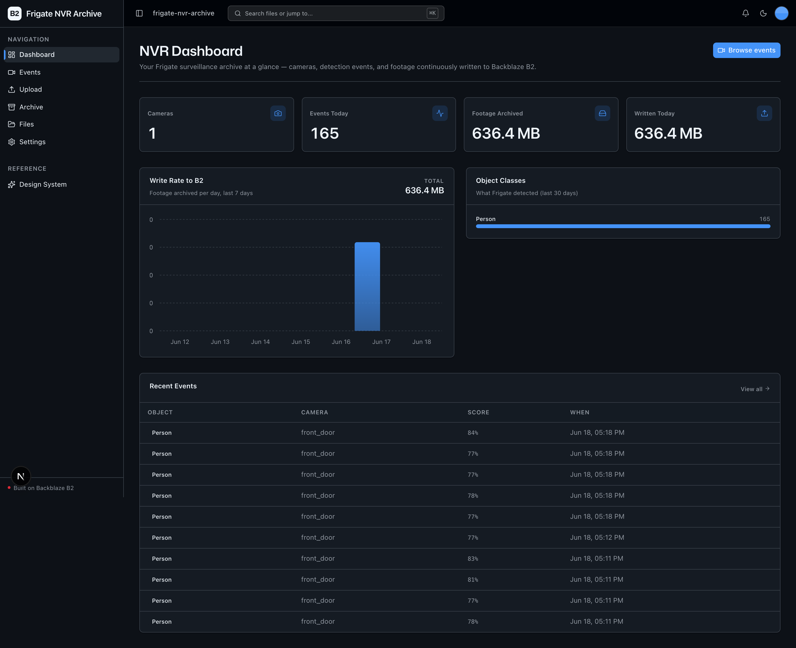
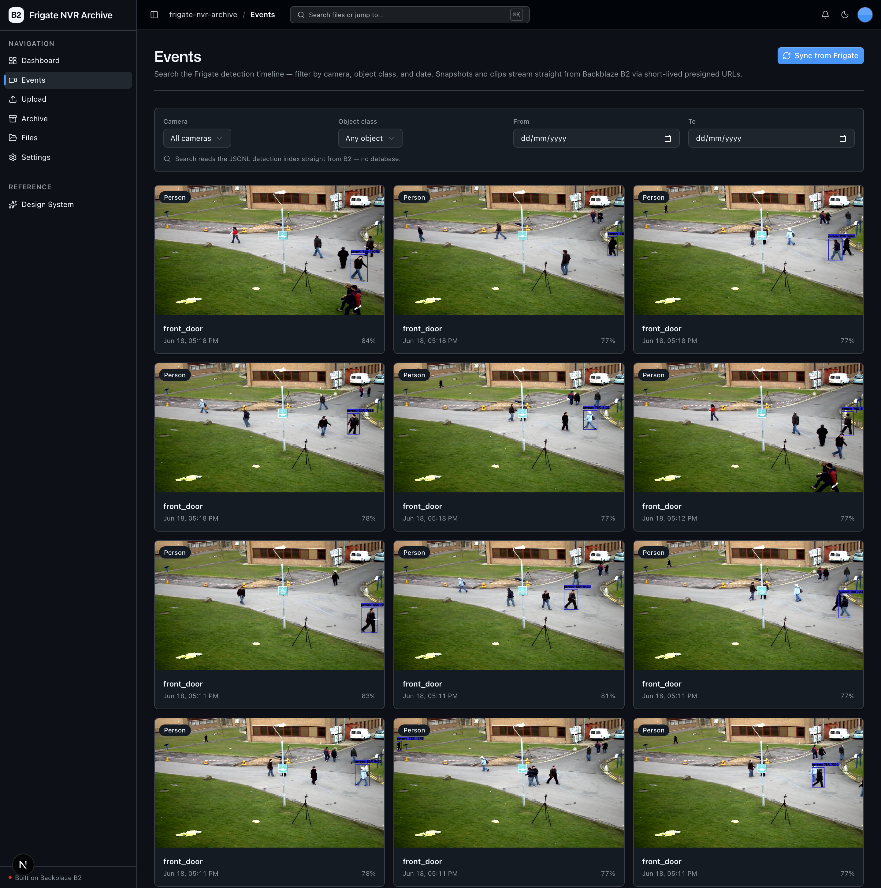

<!-- last_verified: 2026-06-18 -->
# Frigate NVR Archive

A B2 **archive + search + playback layer** on top of a real **[Frigate](https://github.com/blakeblackshear/frigate)** NVR. Frigate ingests your RTSP/CCTV streams and runs **local object detection** (person, car, …) — this sample ships Frigate's recordings, event clips, snapshots, and a searchable detection index to **[Backblaze B2](https://www.backblaze.com/cloud-storage?utm_source=github&utm_medium=referral&utm_campaign=ai_artifacts&utm_content=b2ai-frigate-nvr-archive)**, then lets you search the event timeline and play clips straight from B2.

The pitch: keep **months of affordable surveillance footage on B2** instead of a vendor cloud subscription. A modest 4-camera @ 1 Mbps setup writes ~43 GB/day to B2 indefinitely — the highest sustained write rate of any sample in the fleet.

**Vendor fidelity:** Frigate is the engine. Detection is performed by **real Frigate**, never re-implemented here. Our service only consumes Frigate's HTTP API (`/api/events`, `/api/events/<id>/clip.mp4`, `/api/events/<id>/snapshot.jpg`, recordings) — there is no `ultralytics`/YOLO/torch in our Python.

**What you get out of the box:**
- A real Frigate instance (`infra/frigate/`) you can bring up with one `docker compose` command
- An **archive worker** that streams Frigate events + media to B2 in real time
- **Event timeline & search** ("all persons at the front door this week") backed by a JSONL index in B2 — no database
- **Clip & snapshot playback** straight from B2 via short-lived presigned URLs
- **Archive Library** — a scoped explorer over this app's own `frigate-nvr-archive/` prefix, grouped by camera and date
- The reusable starter scaffolding: full-bucket File Browser, clip Upload, NVR Dashboard, design system

## What it looks like

**NVR Dashboard** — cameras, events today, footage archived to B2, daily write rate, object-class mix:



**Events** — search the detection timeline and play clips from B2:



## How it works

```
Cameras ──RTSP──> Frigate (detect + record)  ──HTTP API──>  Archive worker  ──S3──>  Backblaze B2
                  infra/frigate/                            services/api/             recordings / clips /
                  (the detection engine)                    scripts/archive_worker.py snapshots / index/*.jsonl
                                                                                              │
   Web app  <──presigned URLs / JSONL index──────────────────────────────────────────────────┘
   (Dashboard · Events search · Archive Library · Files)
```

B2 is the **sole data store**. The searchable index is a set of JSONL objects — one detection event per line — under `frigate-nvr-archive/index/<YYYY-MM-DD>.jsonl`. Search loads the partitions for the queried date range and filters them; there is no database.

### B2 object layout (scoped to `frigate-nvr-archive/`)

```
frigate-nvr-archive/
  recordings/<camera>/<YYYY-MM-DD>/<HH>/<segment>.mp4
  events/<camera>/<event_id>/clip.mp4
  events/<camera>/<event_id>/snapshot.jpg
  index/<YYYY-MM-DD>.jsonl        # one detection event per line (searchable)
  index/cameras.json              # camera registry + last-seen summary
  imports/<filename>              # clips imported via the Upload page
```

## Quick Start

You need: Node.js >= 20, pnpm >= 9, Python >= 3.11, Docker (for Frigate), and a free **[Backblaze B2 account](https://www.backblaze.com/cloud-storage?utm_source=github&utm_medium=referral&utm_campaign=ai_artifacts&utm_content=b2ai-frigate-nvr-archive)**.

**1. Install dependencies**

```bash
pnpm install
cd services/api
python -m venv .venv && source .venv/bin/activate
pip install -r requirements.txt
cd ../..
```

**2. Add your B2 credentials + Frigate URL**

```bash
cp .env.example .env
```

Open `.env` and fill in your B2 values. Head to the [Backblaze B2 dashboard](https://secure.backblaze.com/b2_buckets.htm?utm_source=github&utm_medium=referral&utm_campaign=ai_artifacts&utm_content=b2ai-frigate-nvr-archive) and:

1. **Create a bucket.** Paste its values into `.env`:
   - **Bucket Unique Name** → `B2_BUCKET_NAME`
   - **Endpoint** → `B2_ENDPOINT` (e.g. `https://s3.us-west-004.backblazeb2.com`)
   - the region in the endpoint → `B2_REGION` (e.g. `us-west-004`)
2. **Create an application key** with `Read and Write` permission:
   - **keyID** → `B2_APPLICATION_KEY_ID`
   - **applicationKey** → `B2_APPLICATION_KEY` *(only shown once)*

`FRIGATE_URL` defaults to `http://localhost:5000`, which matches the bundled Frigate compose.

> Walkthroughs: [creating a bucket](https://www.backblaze.com/docs/cloud-storage-create-and-manage-buckets) and [creating app keys](https://www.backblaze.com/docs/cloud-storage-create-and-manage-app-keys).

**3. Bring up Frigate (the detection engine)**

Put a short H.264 `.mp4` at `infra/frigate/media/sample.mp4` (your own footage — none is committed), **or** set `FRIGATE_RTSP_INPUT` in `.env` to a real camera RTSP URL and edit `infra/frigate/config.yml` to use it. Then:

```bash
docker compose -f infra/frigate/docker-compose.yml up
```

Open `http://localhost:5000` to confirm Frigate is detecting objects.

**4. Archive Frigate events to B2**

```bash
cd services/api && source .venv/bin/activate
python scripts/archive_worker.py            # poll forever
python scripts/archive_worker.py --once      # single pass, then exit
```

The worker downloads each event's clip + snapshot from Frigate, uploads them to B2, and appends the event to the day's JSONL index. (You can also trigger a one-shot sync from the **Events** page with "Sync from Frigate".)

**5. Run the web app**

```bash
pnpm dev
```

Frontend at `localhost:3000`, API at `localhost:8000`. Browse the Dashboard, search Events, explore the Archive Library, and play clips streamed straight from B2.

`pnpm dev` runs `pnpm doctor` first — a preflight check for the common setup gotchas (wrong Node/Python version, missing venv, missing or placeholder `.env`, busy ports).

## Building on this app

This app was scaffolded from the `vibe-coding-starter-kit`. The starter contract still holds — keep the shared scaffolding, adapt the rest:

- **Keep** the UI kit (`apps/web/src/components/ui/` + design tokens in `globals.css` + `/design`).
- **Keep** the full-bucket File Explorer (`/files`) and Upload (`/upload`) — they're the reusable B2-backed surface.
- **This app's surface**: NVR Dashboard (`/`), Events search (`/events`), Archive Library (`/archive`).

Full contract: [AGENTS.md §2](AGENTS.md#2-building-on-this-app).

## Core Features

- [Continuous archive to B2](docs/features/continuous-archive.md) — stream Frigate recordings, clips, and snapshots to B2 in real time
- [Event timeline & search](docs/features/event-timeline.md) — searchable JSONL detection index in B2; filter by camera / object class / date / zone
- [Clip & snapshot playback](docs/features/clip-playback.md) — presigned-URL streaming straight from B2
- [Archive Library](docs/features/archive-library.md) — scoped explorer over this app's `frigate-nvr-archive/` prefix
- [NVR Dashboard](docs/features/dashboard.md) — cameras, events today, footage archived, write rate, object-class mix
- [File Browser](docs/features/file-browser.md) — full-bucket list, preview, download, delete
- [Clip Upload](docs/features/file-upload.md) — import an external clip/snapshot into the archive
- [Snapshot metadata](docs/features/metadata-extraction.md) — image dimensions, EXIF, checksums

## Tech Stack

- TypeScript, Next.js 16, React 19, Tailwind v4, shadcn/ui, Recharts, TanStack Query
- Python 3.11+, FastAPI, boto3, Pydantic v2, httpx (Frigate client), Pillow
- **Frigate** (the detection engine) — runs locally, no API key
- Backblaze B2 (S3-compatible object storage) — the sole data store
- pnpm workspaces (monorepo)

## Commands

| Command | What it does |
|---------|-------------|
| `pnpm dev` | Start frontend + backend |
| `pnpm dev:web` / `pnpm dev:api` | Frontend / backend only |
| `pnpm build` | Build frontend |
| `pnpm lint` / `pnpm lint:api` | Lint frontend / backend |
| `pnpm test:api` | Run backend tests |
| `pnpm check:structure` | Verify layering rules |
| `python services/api/scripts/archive_worker.py` | Run the Frigate → B2 archive worker |

## Documentation Map

| Doc | Purpose |
|-----|---------|
| [AGENTS.md](AGENTS.md) | Agent table of contents — start here |
| [ARCHITECTURE.md](ARCHITECTURE.md) | System layout, layering, data flows |
| [docs/features/](docs/features/) | Feature docs |
| [docs/app-workflows.md](docs/app-workflows.md) | User journeys (Ingest → Detect → Clip → Index → Query) |
| [docs/dev-workflows.md](docs/dev-workflows.md) | Engineering workflows and testing |
| [docs/SECURITY.md](docs/SECURITY.md) | Security principles |
| [docs/RELIABILITY.md](docs/RELIABILITY.md) | Reliability expectations |

## License

MIT License — see [LICENSE](LICENSE) for details.
